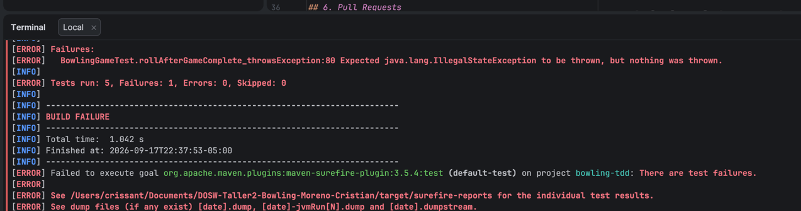
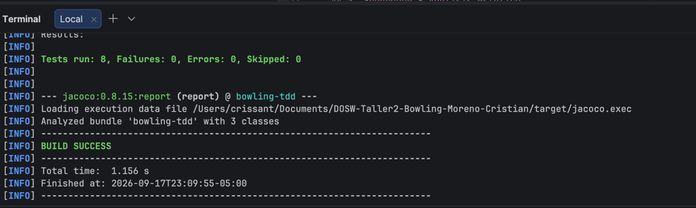
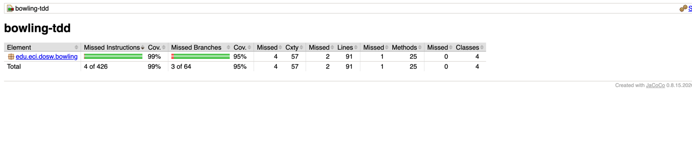
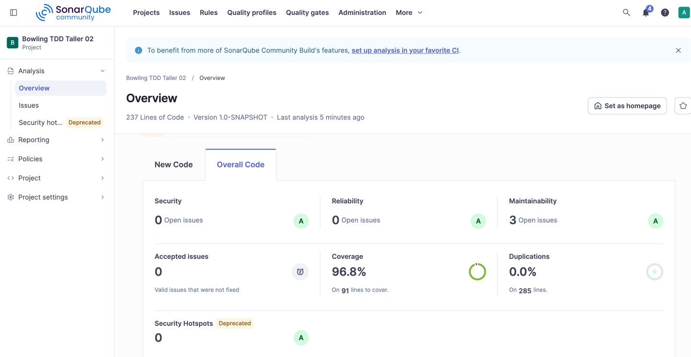
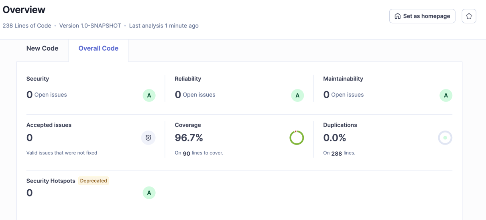

# DOSW Taller 2 - Bowling TDD

## 1. Identificación
- **Nombre completo:** Cristian Santiago Moreno Ruiz
- **Código estudiantil:** 1000100162
- **Correo institucional:** cristian.moreno-r@mail.escuelaing.edu.co

## 2. Descripción

BowlTech S.A.S. quiere digitalizar el sistema de puntuación de sus pistas de bolos. El sistema manual actual olvida los bonos de strike, confunde los spares y se equivoca calculando el juego perfecto. Este proyecto construye el motor de puntuación de un juego de Bowling aplicando Test-Driven Development (TDD) desde cero.

**Reglas implementadas:**
- Tiro normal: puntúan solo los pinos derribados en ese tiro.
- Spare (10 pinos en 2 intentos del mismo frame): 10 + el primer tiro del siguiente frame.
- Strike (10 pinos en el primer intento): 10 + la suma de los dos tiros siguientes.
- Frame 10: si hay strike o spare, se permiten hasta 3 tiros en ese frame.
- Juego perfecto: 12 strikes consecutivos = 300 puntos.

**Responsabilidad de cada clase:**
- `BowlingGame`: orquesta el juego, valida los tiros roll, gestiona la lista de frames y determina si el juego está completo isComplete.
- `Frame`: representa un frame individual; almacena sus tiros, calcula su suma de pinos y determina su tipo (NORMAL, SPARE, STRIKE, TENTH).
- `FrameType`: enum que clasifica el tipo de un frame.
- `BowlingScorer`: clase sin estado que recibe la lista de frames ya jugados y calcula el puntaje total aplicando los bonos de spare y strike.

## 3. Evidencia TDD

**RED** — caso A5, `roll()` debe lanzar `IllegalStateException` cuando el juego ya está completo (antes de implementar `isComplete()`):

**GREEN** — después de implementar `isComplete()` y `validateGameNotComplete()`, con los 8 casos del Módulo A pasando:

## 4. JaCoCo - Cobertura de código

La cobertura se alcanzó de forma natural aplicando TDD estricto en los tres módulos (A, B y C) — no fue necesario escribir pruebas adicionales dedicadas solo a subir el porcentaje, ya que los 22 tests que verifican el comportamiento (validaciones, strike, spare, frame 10, cálculo de puntaje, `isComplete()`) ya cubrían casi todo el código de producción.

**Resultado de mvn clean verify:**

| Métrica | Cobertura |
|---------|-----------|
| Instrucciones | 99% |
| Branches | 95% |
| Líneas | ~98% (89 de 91 líneas) |

Las clases más ejercitadas fueron `BowlingGame` (por los casos de los Módulos A y C) y `BowlingScorer` (por los casos del Módulo B); las únicas líneas sin cubrir corresponden a ramas muy específicas no exigidas por ningún caso de prueba del taller.
## 5. SonarQube - Análisis estático

**Antes de corregir issues** — 3 issues de mantenibilidad (código sin usar, cadena if/else reemplazable por switch, lambda reemplazable por method reference), cobertura 96.8%:

**Después de corregir** — 0 issues abiertos en todas las categorías (Security, Reliability, Maintainability), todas con calificación A, cobertura 96.7%, 0% duplicación:

**Quality Gate:** Passed (todas las condiciones del gate por defecto "Sonar way" se cumplen: cobertura en código nuevo 100%, 0 issues nuevos, duplicación 0%).
## 6. Pull Requests

| PR | Fecha de merge | Módulo que cubre |
|----|----------------|-------------------|
| [Módulo A: BowlingGame.roll() - TDD completo](https://github.com/cristianmorenor/DOSW-Taller2-Bowling-Moreno-Cristian/pull/1) | 2026-09-17     | Módulo A - `roll()` |
| [Módulo B: BowlingScorer.calculate() - TDD completo](https://github.com/cristianmorenor/DOSW-Taller2-Bowling-Moreno-Cristian/pull/2) | 2026-09-17     | Módulo B - `BowlingScorer.calculate()` |
| [Módulo C: BowlingGame.isComplete() - TDD completo](https://github.com/cristianmorenor/DOSW-Taller2-Bowling-Moreno-Cristian/pull/3) | 2026-09-17     | Módulo C - `isComplete()` |
| [Parte 4: Cobertura JaCoCo y analisis SonarQube + fixes de calidad](https://github.com/cristianmorenor/DOSW-Taller2-Bowling-Moreno-Cristian/pull/4) | 2026-09-17     | Parte 4 - JaCoCo y SonarQube |

## 7. Reflexión técnica

